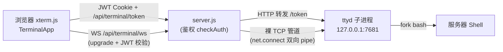

## Product Overview

在 srv-dashboard（Classicy 桌面风格监控面板）中新增一个「终端（Terminal）」窗口应用：登录 Dashboard 后，可直接在浏览器桌面中打开服务器 Shell，基于 ttyd 技术实现，终端 UI 使用 xterm.js 自建并融入 Classicy 风格。

## Core Features

- 桌面新增终端窗口应用：xterm.js 渲染终端，支持自适应窗口大小（FitAddon）、可缩放/关闭
- 后端自动拉起 ttyd：`server.js` 根据 `config.json`/环境变量中的 ttyd 可执行文件路径 spawn 子进程，服务退出时一并清理
- WebSocket 代理：`server.js` 通过 HTTP upgrade 将前端 WS 连接转发至本机 ttyd ws 端点（零依赖裸 TCP 管道转发）
- 鉴权：复用现有 JWT Cookie（`checkAuth`），未登录无法访问 `/api/terminal/*` 的 HTTP 与 WS；路径统一挂在 BASE_PATH 下
- 容错：ttyd 未安装 / 启动失败 / 连接断开时，终端窗口显示友好错误与重试入口
- 支持配置开关（`terminal.enabled`），关闭时桌面不显示终端应用

## Tech Stack

- 后端：Node.js（零依赖风格，仅内置模块）——`child_process.spawn` 拉起 ttyd、`net.connect` 实现 WS 裸 TCP 代理
- 前端：React 19 + TypeScript + `classicy` 窗口组件 + `@xterm/xterm` + `@xterm/addon-fit`
- 构建：Vite 6（dev 代理 `/api/terminal` 需 `ws: true`）

## 实现方案

### 1. server.js —— ttyd 子进程管理

- `cfg` 默认值新增 `terminal: { enabled: false, ttydPath: 'ttyd', ttydPort: 7681, ttydArgs: ['-W', 'bash'] }`，支持环境变量覆盖（沿用 L47-63 的合并模式）
- 启动时若 `enabled` 且存在可执行文件，`spawn(ttydPath, [...ttydArgs, '-p', ttydPort], { stdio: 'ignore' })` 监听 127.0.0.1；`process.on('exit')` 中 `child.kill('SIGTERM')` 清理；启动失败仅 `[warn]` 日志并自动禁用（不阻塞主服务）

### 2. server.js —— 终端代理（零依赖）

- HTTP：`/api/terminal/token` —— 先 `checkAuth(req)`，再 `http.request` 转发到 `http://127.0.0.1:{ttydPort}/token`，透传 ttyd 返回的 `{token}`（JSON）
- WebSocket：`server.on('upgrade')` 新增处理器：

1. 剥离 BASE 前缀（与 `route()` L591-597 相同逻辑），仅匹配 `/api/terminal/ws`
2. `checkAuth(req)` 校验升级请求中的 JWT Cookie，失败则 `socket.destroy()`
3. 用 `net.connect(ttydPort, '127.0.0.1')` 裸 TCP 管道：将客户端首包（请求行改写为 `GET /ws?<query> HTTP/1.1`，Host 改写为 127.0.0.1:ttydPort）写入后双向 `pipe`，无需实现 WS 帧编解码
4. 任一侧 `close`/`error` 时对称销毁对端 socket，防句柄泄漏

### 3. 前端 —— TerminalApp

- `api.ts` 新增 `getTerminalToken()`（fetch 带 cookie，401 时走现有登出/跳登录逻辑）
- `src/apps/TerminalApp.tsx`（参考 `ImcolinApp.tsx` 的 ClassicyApp/ClassicyWindow/appMenu 模板，APP_ID 规范 `srv-terminal.app`）：
- 挂载时获取 token → `new WebSocket((location.protocol==='https:'?'wss':'ws') + '://' + location.host + BASE + '/api/terminal/ws?token=' + token)`，`binaryType='arraybuffer'`
- ttyd 1.7 帧协议：服务端二进制帧首字节为类型（`0` 输出 → `term.write(UTF-8 解码)`；`1` 窗口标题 → 更新窗口标题；`2` ping → 回 pong 心跳）；客户端初始发送 `{"AuthToken":..., "columns":.., "rows":..}`，键盘输入发送带 `0` 类型前缀的二进制帧
- FitAddon 自适应 + 窗口 resize 时重发 `columns/rows`；断线时在终端内打印错误并提供重连按钮
- `terminal.enabled=false` 或 token 获取失败时渲染友好提示
- `src/styles.css` 追加 `.sp-term` 终端容器样式（黑底全填充、focus 边框态）

### 4. 接线

- `src/Desktop.tsx`：在 `<ImcolinApp/>` 后注册 `<TerminalApp/>`
- `vite.config.ts`：dev 代理新增 `'/api/terminal': { target: 'http://127.0.0.1:3000', ws: true, changeOrigin: true }`

### 架构示意

### 性能与可靠性

- WS 代理为逐字节 `pipe`（流式背压由 Node 流自身处理），零拷贝语义，无帧编解码开销；每连接仅 2 个 socket 句柄
- ttyd 生命周期与 server.js 绑定（exit 钩子 + SIGTERM），避免僵尸进程；ttyd 崩溃不影响主服务，仅终端应用显示错误
- 鉴权在 HTTP 与 WS 两个入口统一校验，终端属于高危功能，必须依赖现有 HttpOnly JWT Cookie，不新增明文口令传输

## Design Style

沿用 Classicy（仿 Mac OS 9）桌面隐喻：新应用「Terminal」使用 ClassicyApp + ClassicyWindow 创建标准窗口（可缩放/折叠/关闭），应用图标选用 classicy 内置的应用类图标，标题栏显示主机名。终端区域为黑底（#000000）等宽字体绿/白字，全填充窗口内容区，获得焦点时窗口边框保持 Classicy 条纹风格。窗口右上工具条提供「重连」按钮（ClassicyButton），断连时终端内以红色 ANSI 文本提示。

## Agent Extensions

### Skill

- **frontend-design**
- Purpose: 指导 TerminalApp 终端窗口的视觉设计，确保融入 Classicy 风格且有辨识度
- Expected outcome: 终端窗口 UI（工具条/错误态/黑底终端区）设计落地且风格一致
- **verification-before-completion**
- Purpose: 完成后执行 `npm run build`、登录联调 token+WS 代理、ttyd 缺失容错验证，先取证再宣告完成
- Expected outcome: 构建无错误，鉴权/代理/容错行为均有验证证据